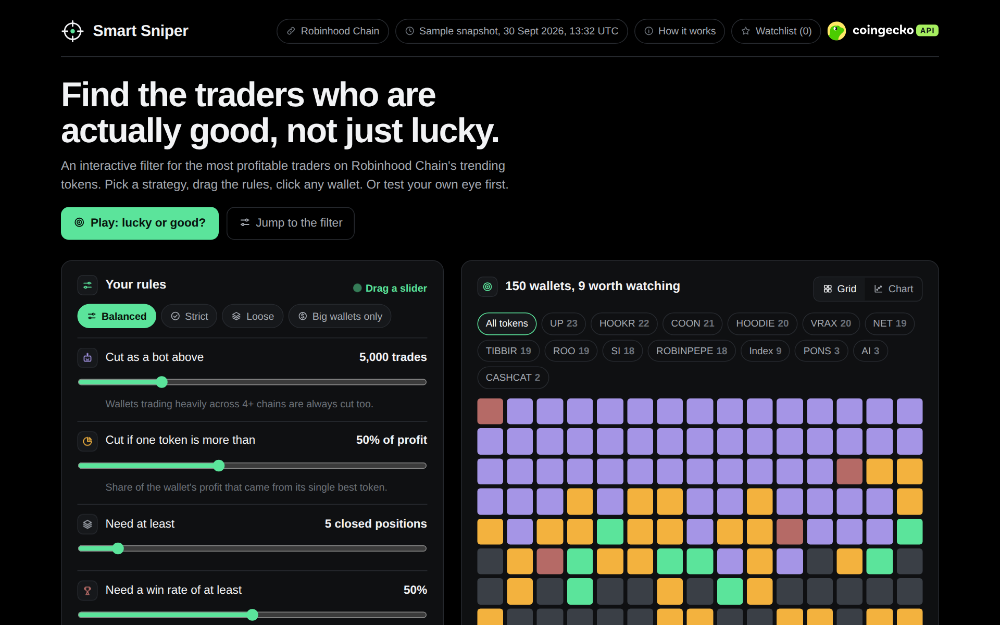
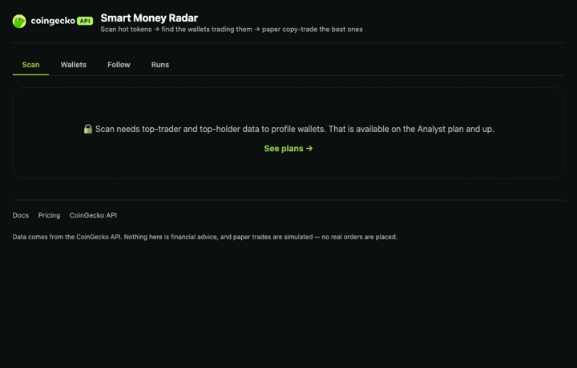

<picture>
  <source media="(prefers-color-scheme: dark)" srcset="core/brand/coingecko-api-on-dark.svg">
  
</picture>

# Smart Sniper

**Find the traders who are actually good, not just lucky.**

Smart Sniper pulls the most profitable traders behind every trending token on a chain, checks each
wallet's full PnL across chains with [CoinGecko API](https://www.coingecko.com/en/api?utm_source=github&utm_content=damidefi),
and sorts them into bots, one-hit wonders and the few worth watching. You set the rules in the
browser and watch it re-sort live.

**Try the demo (sample snapshot):** https://damiedefi.github.io/smart-sniper/
**Run it live:** fork this repo, add your own API key, and run `make sniper` (below).



## What you can do with it

- **Check a token before you touch it.** Tap a trending token and see what share of its top traders are bots. If it's most of them, the volume isn't real demand.
- **Find wallets worth following.** Five adjustable rules cut bots and market makers, wallets whose profit came from one token, wallets with too few closed positions, low win rates, and small accounts.
- **See what good wallets are still holding.** Tokens held by two or more kept wallets show up as leads to research.
- **Compare wallets side by side** and keep a watchlist (saved in your browser).
- **Play "lucky or good?"** Guess a wallet's verdict from its profit, then see the evidence.

## Run it live in 3 steps

```bash
# 1. install (needs Python 3.12 and uv: https://docs.astral.sh/uv/)
make install

# 2. add your CoinGecko API key
cp env.example .env        # then paste your key into .env

# 3. start Smart Sniper
make sniper                # open http://localhost:8001
```

The page loads live data on open, and **Refresh data** pulls a new set. Other chains and sources work
from the URL: `http://localhost:8001/?chain=base&source=trending_1h&wallets=100`

No `make` or `uv`? `pip install -e .` then `uvicorn app.sniper_server:app --port 8001` does the same thing.

**API plan:** the top traders and wallet PnL endpoints need a CoinGecko **Analyst plan or above**
([pricing](https://www.coingecko.com/en/api/pricing?utm_source=github&utm_content=damidefi)). A full refresh is roughly 170 calls (15 tokens + 150 wallets + a couple of pool calls).

## How it uses CoinGecko API

| Step | Endpoint | What it gives Smart Sniper |
|---|---|---|
| 1 | `/onchain/networks/{chain}/trending_pools` | The tokens trending on the chain right now |
| 2 | `/onchain/networks/{chain}/tokens/{token}/top_traders` | The wallets with the highest realized profit on each token |
| 3 | `/onchain/wallets/{address}/pnl` | Each wallet's realized PnL, win rate and holdings across 9 EVM chains, in one call |

Wallets with 1,500+ trades in a single token are dropped before step 3 (obvious bots, no point
spending credits). The rest are sampled evenly so the busiest bots at the top of each list don't
crowd out everyone else.

**What comes from CoinGecko vs what this repo decides:** prices, pools, traders and PnL come from
CoinGecko API. The verdicts (bot, one-hit wonder, kept), thresholds and presets are this repo's own
logic, computed in your browser. They're editable examples, not CoinGecko labels.

## Make it yours

- **Change the rules:** the sliders and presets live in `web/sniper.html` (`DEFAULTS` and `PRESETS`).
- **Change what gets fetched:** `app/sniper.py` (tokens per scan, traders per token, wallets sampled).
- **Point it at another chain:** add `?chain=base` (or any chain CoinGecko's onchain API covers).
- **Script it instead:** `make lucky` runs the same filter in the terminal and writes an HTML report to `runs/`.

## Project layout

```
app/sniper.py          builds the live dataset from CoinGecko API
app/sniper_server.py   serves the UI and /api/snapshot (your key stays on your machine)
web/sniper.html        the interactive UI
docs/index.html        the hosted demo (sample snapshot, no API key needed)
app/lucky.py           terminal version of the filter
tests/                 offline tests, no API calls
```

Research only, not financial advice.

---

## Smart Money Radar (base starter)

Scan today's hottest tokens, find the wallets trading them, score every wallet on real PnL and
copyability, then paper copy-trade the best ones -- on autopilot if you want. It's the CoinGecko
API wallet endpoints doing what a screener can't: your own rules, running on real trade history,
24/7.



## Get your API key

Grab a free key at [coingecko.com/en/api](https://www.coingecko.com/en/api?utm_source=github&utm_content=damidefi). The
Scan and Wallets tabs need an **Analyst** plan or higher (that's where `top_traders`, `top_holders`
and the wallet endpoints live); trending/new pools work on the free Demo plan, and the app shows a
locked card instead of hanging when a feature isn't on your plan.

## What you need

- Python 3.12 and [`uv`](https://docs.astral.sh/uv/)
- A CoinGecko API key ([get one](https://www.coingecko.com/en/api?utm_source=github&utm_content=damidefi))
- An AI coding agent (Claude Code or Codex) if you want to reskin or extend this

## Important data and chain notes

### CoinGecko data vs. repo-derived outputs

CoinGecko API supplies the underlying market, token, pool, trade and wallet data used by this
project. Wallet labels, skill and copyability scores, bot-like classifications, shortlists,
signals, paper-trading decisions and reports are computed by this repository. They are editable
examples, not CoinGecko API fields, official CoinGecko classifications, financial advice or
validated trading signals. Inspect the supporting data and adapt the formulas before relying on
them in your own workflow.

### Recommended chains for end-to-end testing

For demos that combine discovery with the complete wallet workflow, start with **Ethereum, Base,
BNB Chain, Robinhood Chain or Arc Chain**. Solana still offers useful market, token, pool and trade
data together with wallet P&L and wallet-trade history, while its wallet balance and transfer
coverage is currently more limited. Use one of the recommended chains when your build depends on
those additional wallet views.

This note is implementation context for you and your coding agent; chain-coverage gaps do not need
to become the topic of creator-facing content.

## Quickstart

```
make install
cp env.example .env   # then paste your key into .env
make run               # http://localhost:8000
```

## Make it yours with your AI agent

Paste any of these into Claude Code or Codex, from inside this repo:

1. "Change the Scan tab's default source from trending_1h to new_pools, and change the default budget to $250."
2. "Restyle this to a purple/black theme. Keep the CoinGecko badge and the links block intact."
3. "Add a filter to the Wallets tab for wallets seen in 3+ tokens this scan."
4. "Make Base the default chain and explain how `WALLET_CHAIN_CAPS` handles endpoint differences."
5. "Change the copyability formula in `app/scoring.py` to weight trade frequency more heavily."
6. "Add a Telegram or Discord webhook that posts every autopilot decision."

See `AGENTS.md` for the full repo map and customization recipes.

## How it works

```
Discovery                Real-time-ish              Your logic              Execution
trending/new pools   →   poll followed wallets   →   scoring + rules   →   paper trades
top_traders/holders      every N seconds             (app/scoring.py,        (core/paper.py)
wallet pnl/trades                                     app/backtest.py)
```

| Layer | Endpoints used |
|---|---|
| Discovery | trending pools, new pools, megafilter, `top_traders`, `top_holders` |
| Wallet profiling | `wallets/{address}/pnl`, `networks/{network}/wallets/{address}/trades`, `wallets/{address}/balances` |
| Decision logic | your rules in `app/scoring.py` + `app/backtest.py` |
| Execution | paper trading only (`core/paper.py`) |

### The four modes

```
make backtest SOURCE=trending_1h CHAIN=base     # walk-forward: select on the first 60%, replay the last 40%
make forward MINUTES=3                          # live on paper, logs every decision
make autopilot                                  # rescans + re-scores + trades on paper, forever
make report RUN=latest                          # report.html + report-card.png for any run
make article-kit RUN=latest HANDLE=you           # article-kit/ ready for an X Article
```

## What you can do on each plan

| Feature | Demo (free) | Analyst+ |
|---|---|---|
| Trending / new pools | ✅ | ✅ |
| Safe-movers megafilter | 🔒 [upgrade](https://www.coingecko.com/en/api/pricing?utm_source=github&utm_content=damidefi) | ✅ |
| `top_traders` / `top_holders` (Scan) | 🔒 [upgrade](https://www.coingecko.com/en/api/pricing?utm_source=github&utm_content=damidefi) | ✅ |
| Wallet PnL / trades / balances (Wallets, Follow) | 🔒 [upgrade](https://www.coingecko.com/en/api/pricing?utm_source=github&utm_content=damidefi) | ✅ |

Demo software. Paper trading only. CoinGecko API provides market data; it doesn't execute trades or
give financial advice.

<!-- coingecko-links:start -->
- CoinGecko API: https://www.coingecko.com/en/api?utm_source=github&utm_content=damidefi
- Pricing: https://www.coingecko.com/en/api/pricing?utm_source=github&utm_content=damidefi
- Docs: https://docs.coingecko.com?utm_source=github&utm_content=damidefi
- Agent Skill + MCP: https://docs.coingecko.com/ai-integration?utm_source=github&utm_content=damidefi
<!-- coingecko-links:end -->
